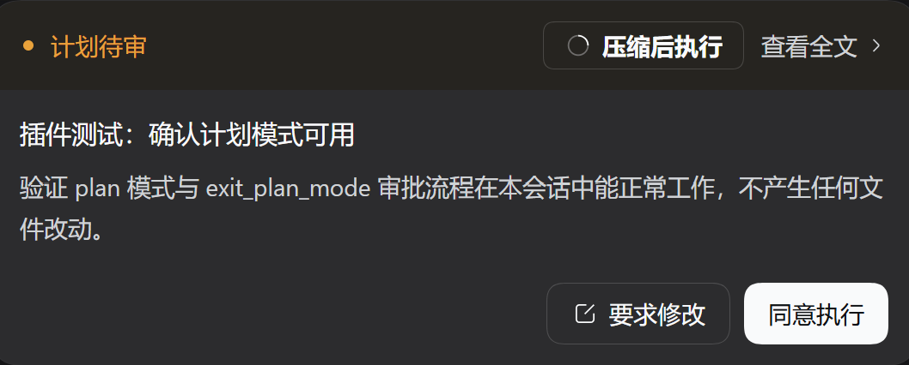

# dsh-plan-compact-execute

Adds a third option — **Compact and run** — to the DSH Web plan-review card: compact the history submitted before the plan into one summary checkpoint, then approve the plan, so the model starts executing with the **verbatim plan** still in context.

The button appears in the card's title row, to the left of the official "full plan" link, so that row reads `[Compact and run] View full plan ›`; the official "Request changes / Approve" pair stays in the footer row, byte-for-byte unchanged.

[中文](README.md) | English



## What it does

- A "Compact and run" button joins the card's title row.
- "Compact and run" first condenses the session's history **submitted before the plan** into a summary, then answers the pending review with the question's own approve label (`exit_plan_mode`'s `Approve`), and plan mode exits.
- The plan text, the review transcript, and the unfinished tool batch stay verbatim; earlier exploration is replaced by a summary checkpoint (shown as "已压缩" in the conversation).
- **While the compaction runs the whole review card is replaced by a progress card** ("Compacting the context" / "Running the plan"), and the official decisions are unreachable for that window, so a second decision can never land while the host is rewriting the history.
- **Every failure unlocks immediately**: the progress card disappears and the official card returns as it was (the official side was never unpublished), with both official decisions available. The failure names the step that failed — a host compaction failure shows "Compaction failed: <host diagnostic>", a compaction that succeeded but could no longer deliver the answer (for example another surface settled it first) shows "The plan was not run: <reason>", and an answer that landed while the panel refused to close shows "Reply sent; the panel could not close.".

## Installing

```bash
dsh plugin --profile web add dsh-plan-compact-execute
```

| Requirement | Value |
|---|---|
| Node | 24 (the test suite needs 22.15) |
| DSH | `0.1.7-rc.2` / `0.2.0-rc.2` |

- **The host half is a loaded JS artifact, so restart the gateway after changing it**; the client bundle is watched by `dsh-client-modules`, so editing `lib/client.js` hot-replaces it.

## Why not `/compact`

`/compact` goes through `ctx.compaction.compactNow()`, which claims the agent's true idle phase; a plan review happens inside the `exit_plan_mode` tool call, so the agent is mid-turn and that path necessarily fails.

This plugin uses `ctx.compaction.compactRegion(...)` — the same in-turn path automatic step-pressure compaction uses: the compaction bracket lands between the tool call and its approval result (measured on a real run as `call seq=37 < compaction seq=38 < result seq=42`), which is exactly "compact first, approve second".

`/compact` retention keeps only the last surface node, which on this card would shadow the plan itself into the summary; this plugin retains the tail up to the unfinished tool batch, so the plan stays verbatim.

## Configuration

| Field | Default | Meaning |
|---|---|---|
| `minShadowedTokens` | `2000` | Route-priced tokens the compactable span must hold, otherwise the request proceeds and the host logs why |

```yaml
- id: plan-compact-execute
  name: dsh-plan-compact-execute
  config:
    minShadowedTokens: 4000
```

## License

MIT
